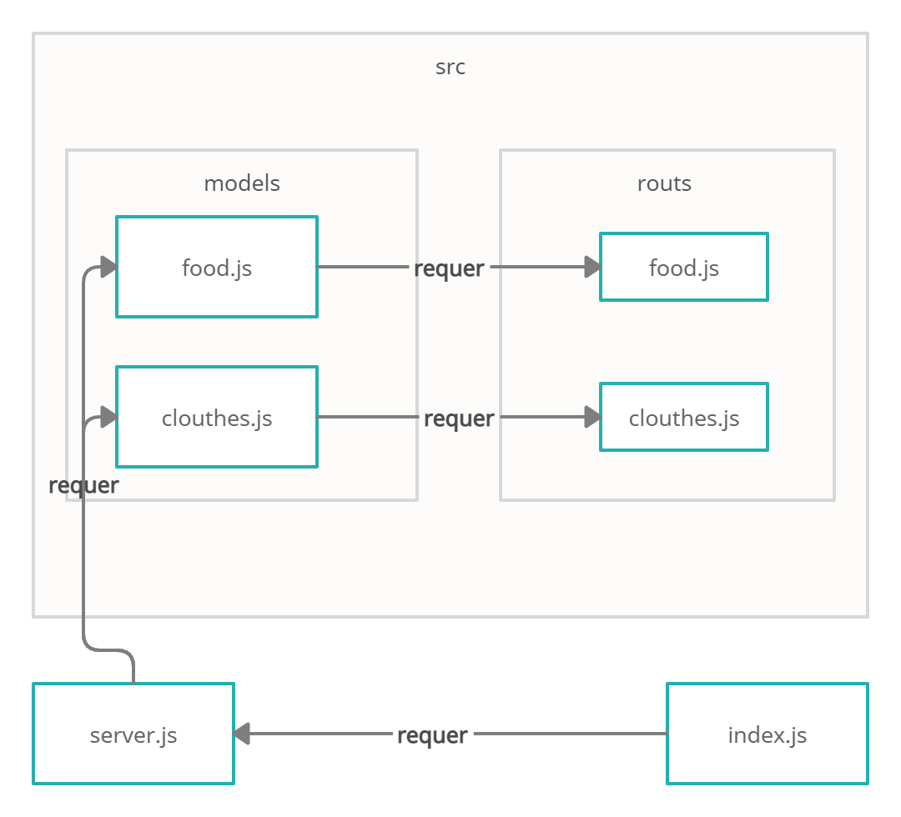

# basic-api-server

# basic-express-server

* [GitHub actions](https://github.com/ahmadfrijat/basic-express-server/actions)
* [pull request](https://github.com/ahmadfrijat/basic-express-server/pull/1)
* [heroku deployment app](https://ahmad-basic-express-server.herokuapp.com/)


# how to work :

* ```npm init -y ```
* ```npm i express dotenv cors morgan uuid ```
* ```npm i -D supertest jest ```


# UML :
